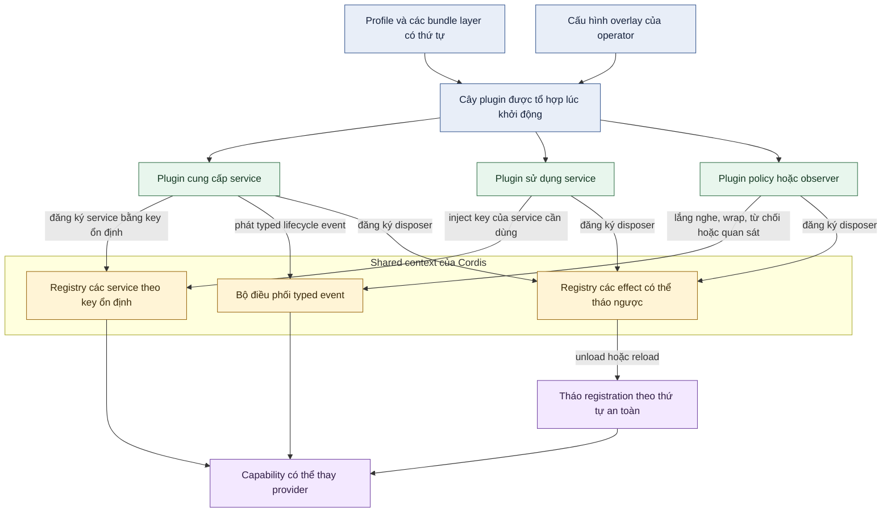
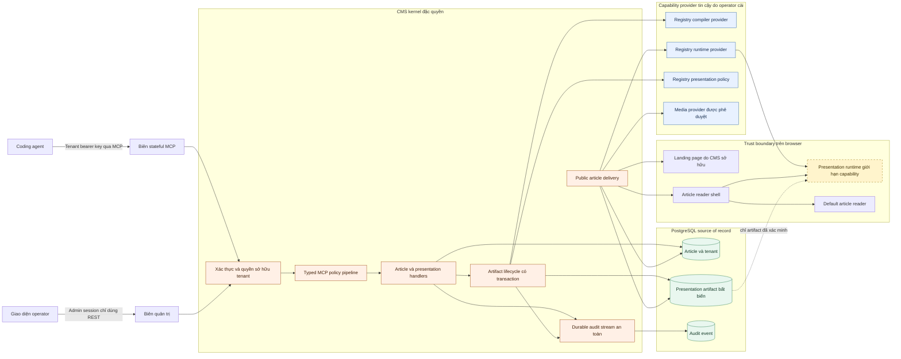
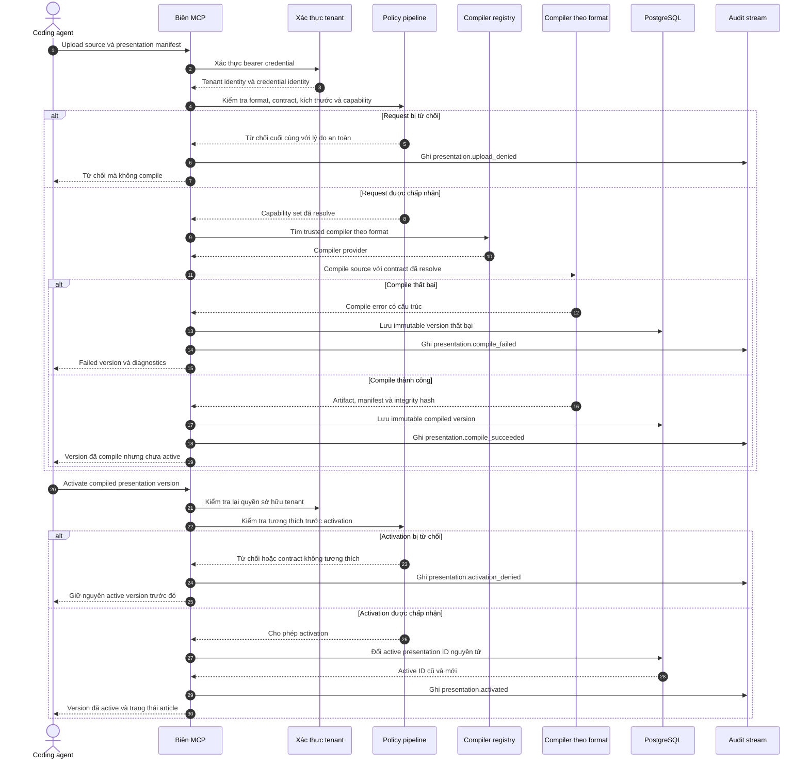
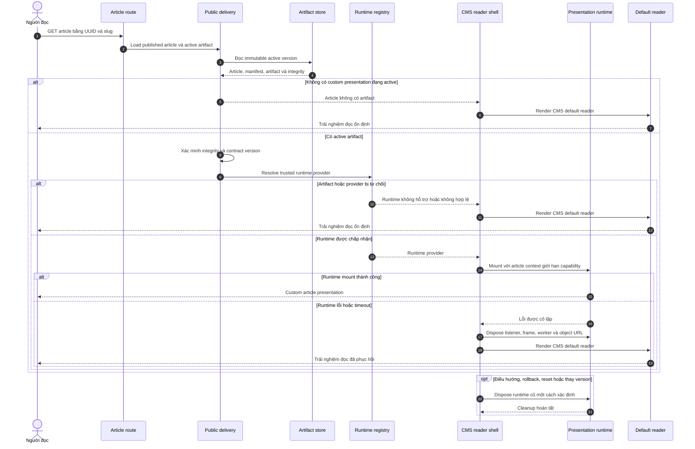
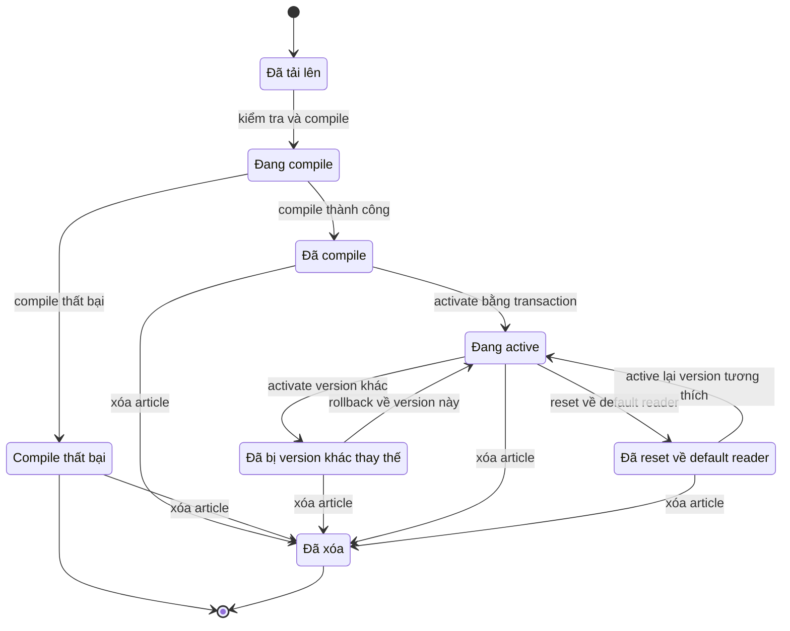

# Future architecture diagrams

These diagrams accompany the
[capability-oriented presentation runtime proposal](capability-oriented-presentation-runtime.md).
They use Mermaid fenced blocks so GitHub renders them directly while keeping
the source reviewable in version control.

The diagrams describe a possible future direction. They are not a statement
that every component or contract shown here already exists.

## 1. Cordis philosophy at a glance

This component diagram summarizes the ideas worth learning from Cordis and
DeepSeek Harness: composition through a shared context, dependencies by stable
service keys, typed events for interception, and reversible registrations.

The key lesson is not that every class must become a plugin. The useful lesson
is that extensions depend on stable capability definitions, attach only at
documented seams, and own cleanup for every effect they register.

## 2. Selective application in Agent-Native CMS

The CMS keeps security and data invariants inside a privileged kernel. Trusted
providers are installed by the operator, while tenant-submitted presentation
programs remain untrusted immutable artifacts.

The provider registry is not tenant-extensible server code. Tenants may request
an allowed `format`, `runtime`, and capability set in a manifest; only the
kernel can resolve those requests to trusted providers.

## 3. Upload, compile, and activate a presentation

This sequence preserves the current rule that uploading never activates a
presentation implicitly. Compilation produces an immutable version, and a
separate activation transaction changes public behavior.

## 4. Public runtime, fallback, and reversible cleanup

The browser runtime must fail locally to one article. A broken artifact must not
break the CMS landing page, routing, or other articles.

## 5. Presentation artifact state model

This state diagram makes reversibility explicit. A failed upload is retained for
diagnostics but can never become active. Rollback activates an older compatible
compiled version rather than mutating an artifact in place.

The database record remains immutable after compilation. Terms such as
`Active`, `Superseded`, and `Reset` describe the article's selection relationship
to artifact versions, not source-code mutation.
