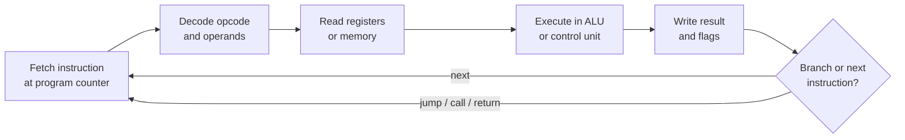
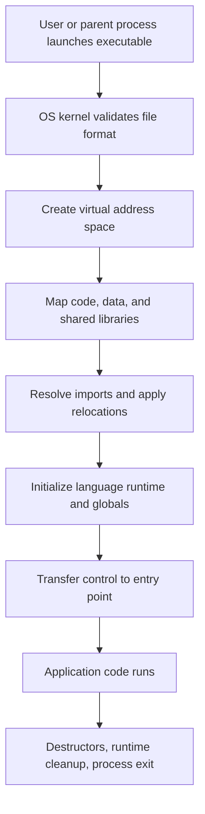
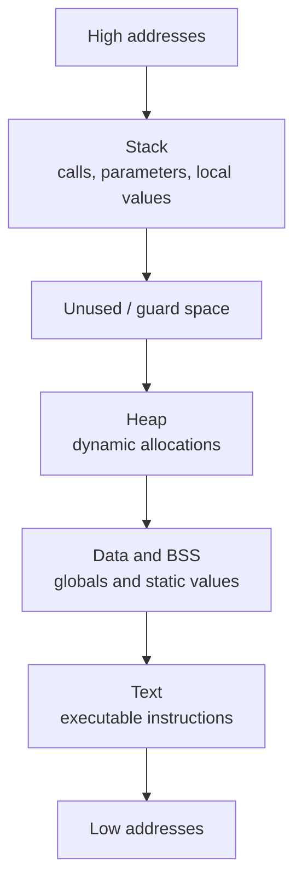
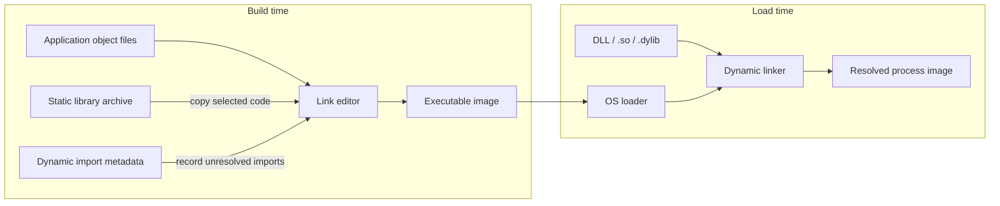
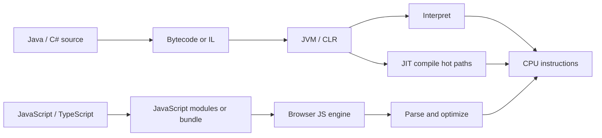
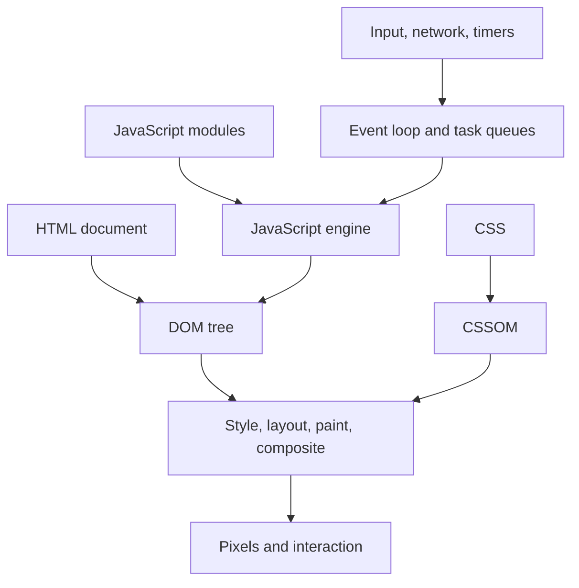
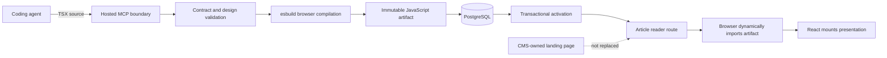

# How programs run

Source code is not executed by a CPU as written. Toolchains translate it into
artifacts, the operating system loads those artifacts, and a runtime may add
another layer of interpretation or just-in-time compilation.

## 1. The machine underneath every paradigm

At this level, a loop is a conditional jump, a function call changes control
flow and preserves a return location, and an object is ultimately bytes plus
conventions. Higher-level paradigms make those operations understandable and
safe enough for humans to compose.

## 2. Native compilation pipeline

For a conventional C/C++-style toolchain, the linear path is best understood
as a flowchart. GCC documents the central sequence as preprocessing,
compilation, assembly, and linking.

```mermaid
flowchart LR
  Source["Source files<br>.c / .cpp"] --> Preprocess["Preprocessor<br>expand includes and macros"]
  Preprocess --> Frontend["Compiler frontend<br>tokens, AST, type checks"]
  Frontend --> IR["Intermediate representation<br>language-neutral operations"]
  IR --> Optimize["Optimizer<br>transform without changing meaning"]
  Optimize --> Backend["Compiler backend<br>target instructions"]
  Backend --> Assembly["Assembly<br>.s"]
  Assembly --> Assembler["Assembler"]
  Assembler --> Objects["Object files<br>.o / .obj"]
  Objects --> Linker["Linker<br>resolve symbols and relocate"]
  Libraries["Static or import libraries"] --> Linker
  Linker --> Executable["Executable<br>ELF / PE / Mach-O"]

  classDef source fill:#eef2ff,stroke:#4f46e5,color:#1e1b4b
  classDef transform fill:#ecfeff,stroke:#0891b2,color:#164e63
  classDef artifact fill:#f0fdf4,stroke:#16a34a,color:#14532d
  class Source,Libraries source
  class Preprocess,Frontend,IR,Optimize,Backend,Assembler,Linker transform
  class Assembly,Objects,Executable artifact
```

Not every language exposes every stage, and toolchains often fuse stages, but
the conceptual responsibilities remain useful.

## 3. Loading an executable

The exact layout varies by platform and security settings. The diagram is a
mental model, not a fixed memory-address contract.

## 4. Static and dynamic linking

Static linking copies needed library code into the executable. Dynamic linking
leaves compatible symbol references for a loader to resolve against shared
libraries. The shared boundary is an ABI: binary format, symbol names, calling
conventions, data layout, and version assumptions.

## 5. Managed and browser runtimes

## 6. Where Agent-Native CMS enters the pipeline

The CMS does not upload a native executable or DLL into the server. Today it
accepts constrained TSX, compiles it to a browser JavaScript artifact, stores
that immutable version, and lets the article route load only the active one.

This resembles runtime plugin loading in lifecycle, but differs in trust and
location: the submitted program is presentation code for a browser boundary,
not a privileged server extension.

## References

- [GCC: options controlling the kind of output](https://gcc.gnu.org/onlinedocs/gcc/Overall-Options.html)
- [System V ABI: ELF object format and dynamic linking](https://refspecs.linuxfoundation.org/elf/elf.pdf)
- [Microsoft: PE format](https://learn.microsoft.com/en-us/windows/win32/debug/pe-format)
- [WebAssembly core specification](https://webassembly.github.io/spec/core/)

