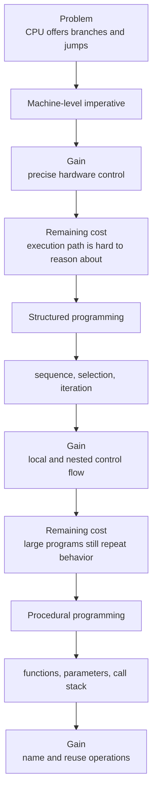
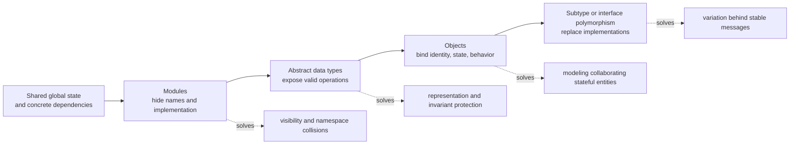
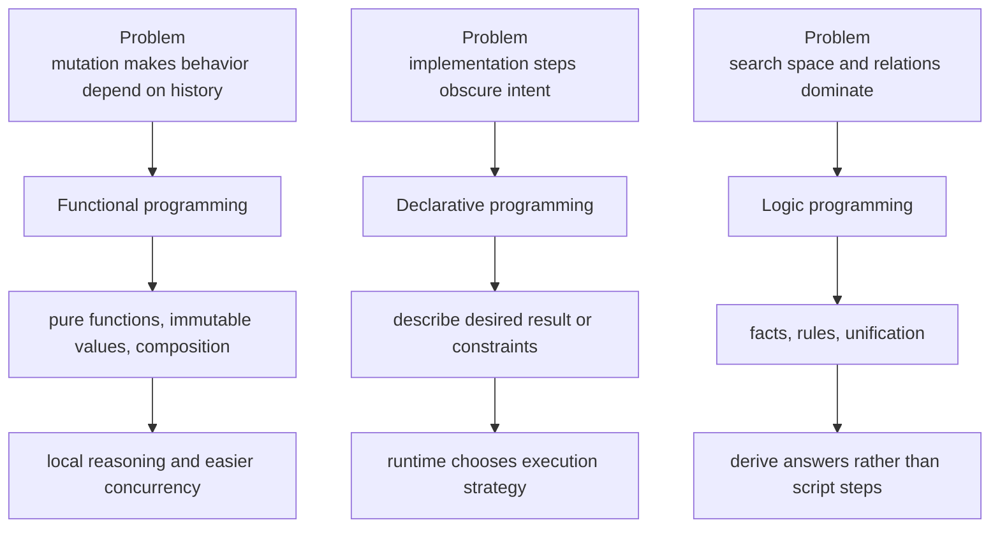
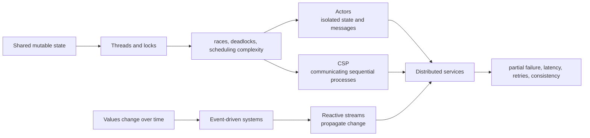
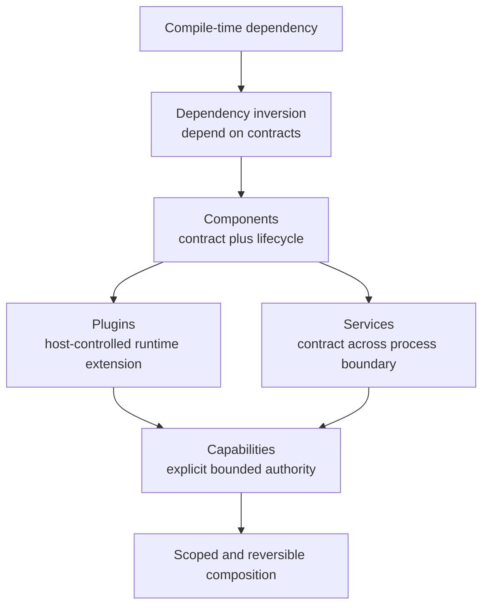
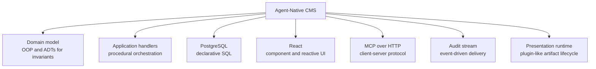

# Programming paradigms: a problem-driven survey

Programming paradigms do not replace the machine model. They add structures
that help humans control a growing kind of complexity.

## 1. The abstraction ladder

```mermaid
flowchart LR
  Instructions["Machine and assembly<br>Control instructions"] --> Structured["Structured programming<br>Control flow"]
  Structured --> Procedures["Procedural and modular<br>Reusable behavior and visibility"]
  Procedures --> Objects["OOP and ADTs<br>State, invariants, polymorphism"]
  Objects --> Declarative["Functional, logic, declarative<br>Meaning over execution steps"]
  Declarative --> Concurrent["Actors, CSP, reactive<br>Time and coordination"]
  Concurrent --> Distributed["Services and events<br>Process and failure boundaries"]
  Distributed --> Composition["Capability composition<br>Authority, scope, lifecycle"]
```

The arrows mean “new pressure became prominent,” not “the older style became
obsolete.” A modern system routinely uses several rows at once.

## 2. From jumps to structured control flow

Dijkstra's structured-programming work targeted the difficulty of relating a
program's textual structure to its execution history. It did not claim that a
CPU stops using jumps; it constrained how programmers express them.

## 3. Modules, abstract data types, and OOP

OOP's core contribution is not merely classes. It provides a way to preserve
state and invariants behind a message/interface boundary. Its common failure
mode is turning inheritance and object graphs into hidden coupling.

## 4. Functional, declarative, and logic styles

SQL is a familiar declarative example: callers specify the result shape while
the database optimizer chooses a physical plan.

## 5. Time, concurrency, and communication

Concurrency paradigms manage overlapping work in one or more processes.
Distributed architecture adds independent failure, network delay, and separate
deployment authority; it is not just “concurrency over HTTP.”

## 6. Components, services, plugins, and capabilities

This row is where Cordis belongs. It is a runtime composition model built from
services, typed events, scopes, and reversible registrations. Those concepts
can host code written in OOP, functional, or procedural style.

## 7. What each approach primarily controls

| Approach | Primary unit | Main problem addressed | Typical remaining pressure |
| --- | --- | --- | --- |
| Machine / assembly | Instruction | Exact hardware execution | Human reasoning |
| Structured | Block | Arbitrary control flow | Reuse and scale |
| Procedural | Procedure | Reusable behavior | Data invariants |
| Modules / ADTs | Module / type | Visibility and representation | Runtime variation |
| OOP | Object | Stateful collaboration and polymorphism | Hidden coupling |
| Functional | Function / value | Mutation and composition | Effects and integration |
| Declarative / logic | Rule / relation | Intent over execution order | Runtime control and cost |
| Event-driven / reactive | Event / stream | Change over time | Causality and backpressure |
| Actor / CSP | Actor / channel | Concurrent coordination | Distributed failure |
| Components / plugins | Component | Replaceability and lifecycle | Authority and isolation |
| Services | Network contract | Independent processes and deploys | Latency and consistency |
| Capability composition | Capability / scope | Authority, context, reversible lifecycle | Governance and observability |

## 8. A modern application uses many paradigms simultaneously

The practical question is not “Which single paradigm wins?” It is “Which
pressure exists at this boundary, and which abstraction makes it explicit?”

## References

- [Dijkstra: Notes on Structured Programming](https://www.cs.utexas.edu/~EWD/transcriptions/EWD02xx/EWD249.html)
- [Parnas: On the Criteria To Be Used in Decomposing Systems into Modules](https://dl.acm.org/doi/10.1145/361598.361623)
- [Hoare: Communicating Sequential Processes](https://www.cs.cmu.edu/~crary/819-f09/Hoare78.pdf)
- [Hewitt, Bishop, and Steiger: A Universal Modular ACTOR Formalism](https://www.ijcai.org/Proceedings/73/Papers/027B.pdf)
- [DeepSeek Harness: Cordis primer](https://github.com/deepseek-ai/deepseek-harness/blob/master/docs/cordis-primer.md)

