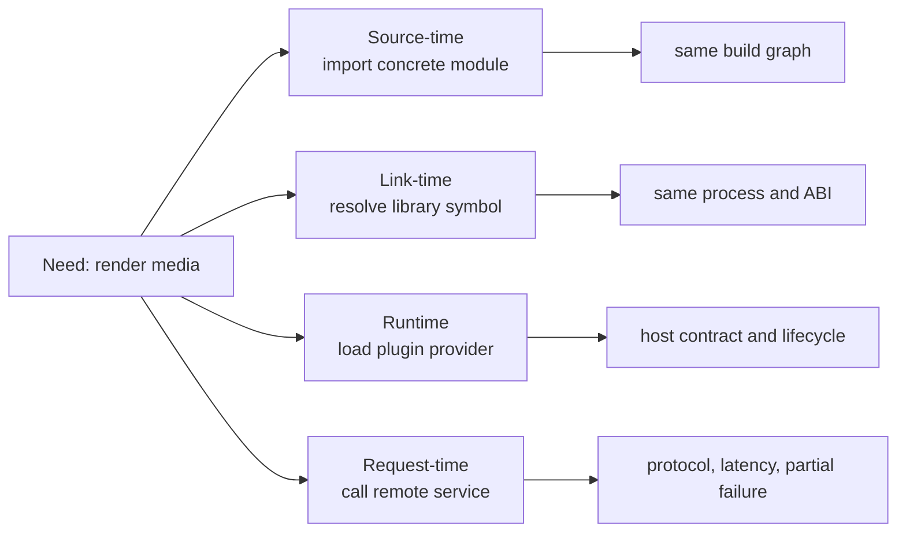
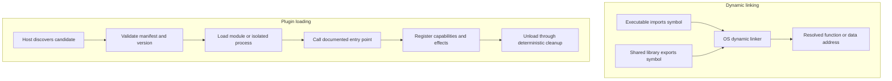
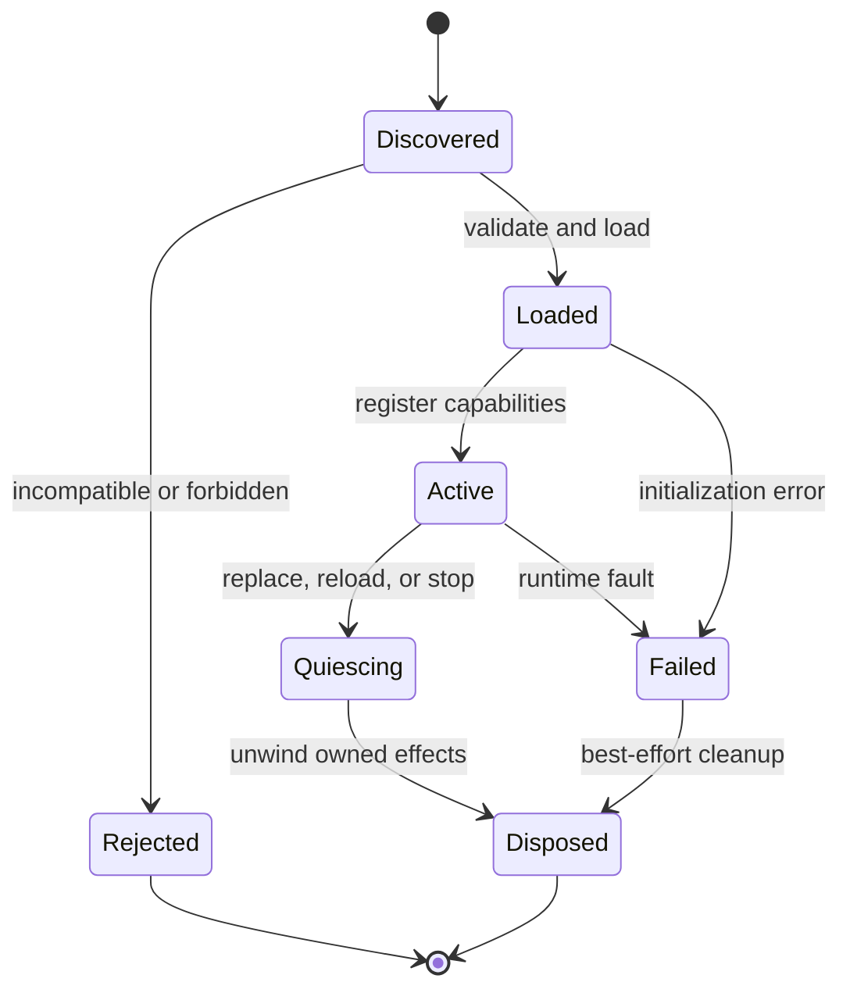
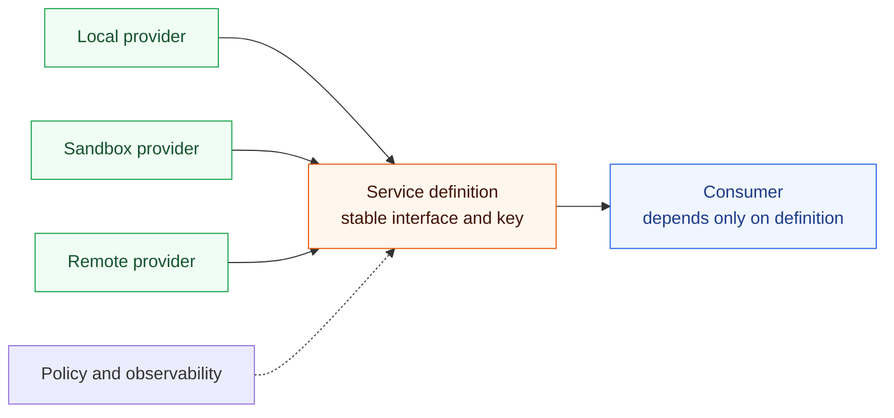
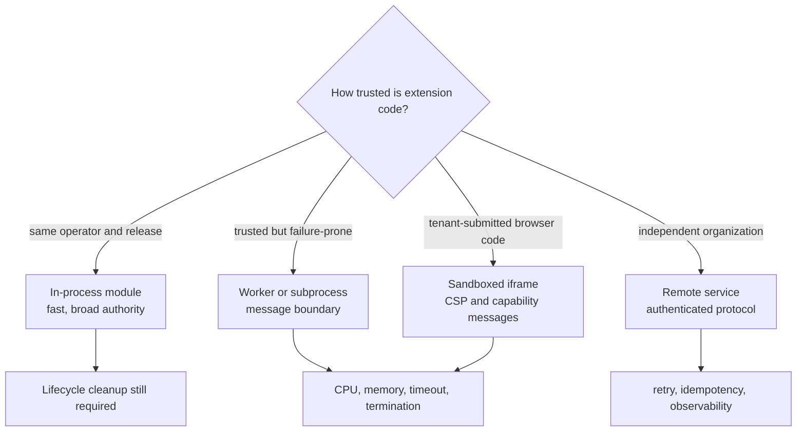
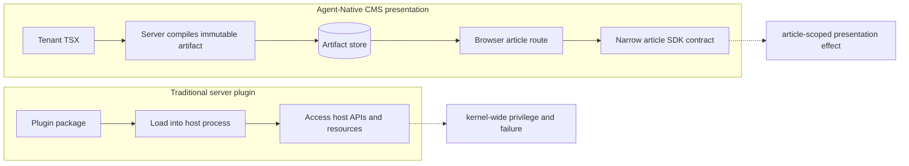

# Linking, components, and plugins

Libraries, plugins, and remote services all enable reuse, but they cross
different boundaries and fail in different ways.

## 1. One capability, four binding times

The later a binding decision occurs, the more replaceability becomes possible;
the host also assumes more validation, lifecycle, and failure-handling work.

## 2. Static library, shared library, plugin, and service

| Mechanism | Bound when | Executes where | Compatibility boundary | Failure blast radius |
| --- | --- | --- | --- | --- |
| Static library | Link time | Same process | Object format + linker contract | Process |
| DLL / shared object | Load time | Same process | ABI + exported symbols | Process |
| Managed plugin | Runtime | Usually same process | Host API + language/runtime version | Often process |
| Worker / subprocess | Runtime | Isolated execution context | Message protocol | Worker/process |
| Remote service | Request time | Another process or host | Network protocol | Partial/network failure |
| CMS presentation | Article-view runtime | Visitor browser | Artifact + SDK contract | One article reader |

## 3. Dynamic linking versus plugin loading

A DLL can be used to implement a plugin, but a DLL alone does not define
discovery, policy, ownership, registration, or cleanup. Those are host-level
contracts.

## 4. The plugin host lifecycle

Without an ownership rule for effects, unloading is unsafe. Event listeners,
timers, file handles, routes, workers, and cached references can outlive the
plugin that created them.

## 5. Capability seams

A useful seam needs all three roles: definition, provider, and consumer. Merely
wrapping a class in an interface does not prove replaceability; at least two
meaningfully different providers should pass the same lifecycle contract.

## 6. Isolation choices

## 7. Traditional plugin versus CMS presentation

This distinction is central to the project. Dynamic loading is a mechanism;
the architecture is defined by where code executes, which authority it gets,
and how its effects are contained and reversed.

## References

- [System V ABI: ELF dynamic linking](https://refspecs.linuxfoundation.org/elf/gabi4%2B/ch5.dynamic.html)
- [Microsoft: Dynamic-link library search order](https://learn.microsoft.com/en-us/windows/win32/dlls/dynamic-link-library-search-order)
- [DeepSeek Harness: capability seams](https://github.com/deepseek-ai/deepseek-harness/blob/master/docs/capability-seams.md)

