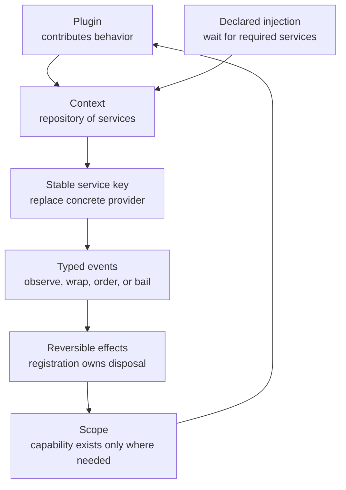
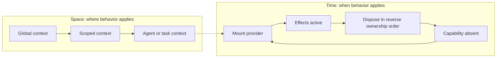
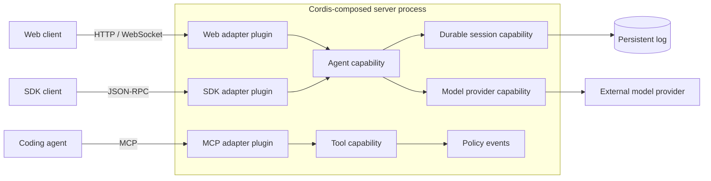
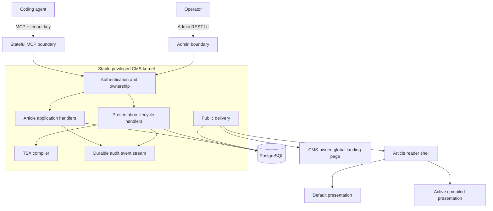
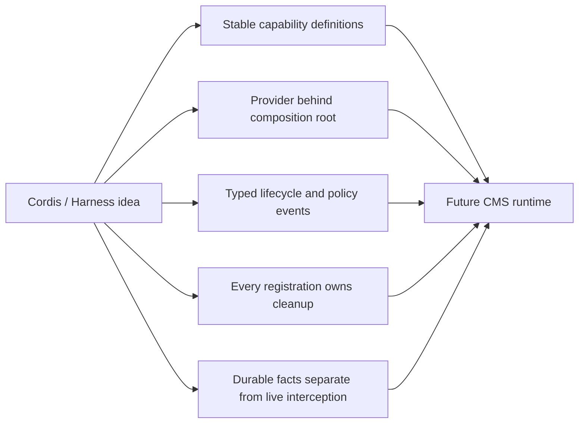
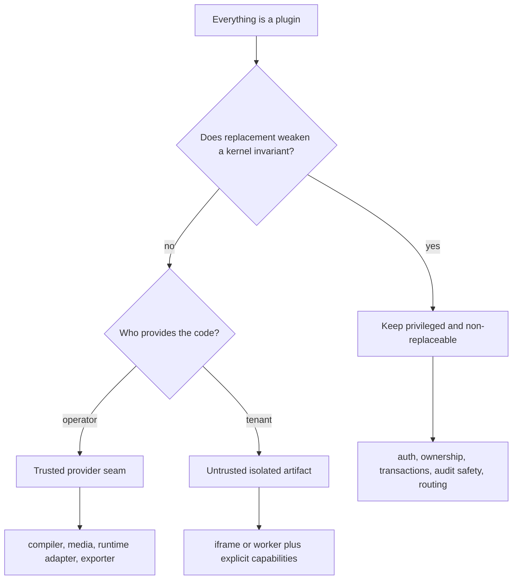
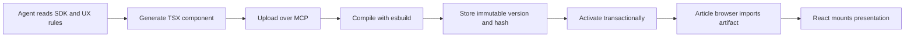
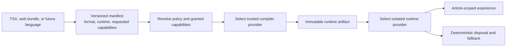
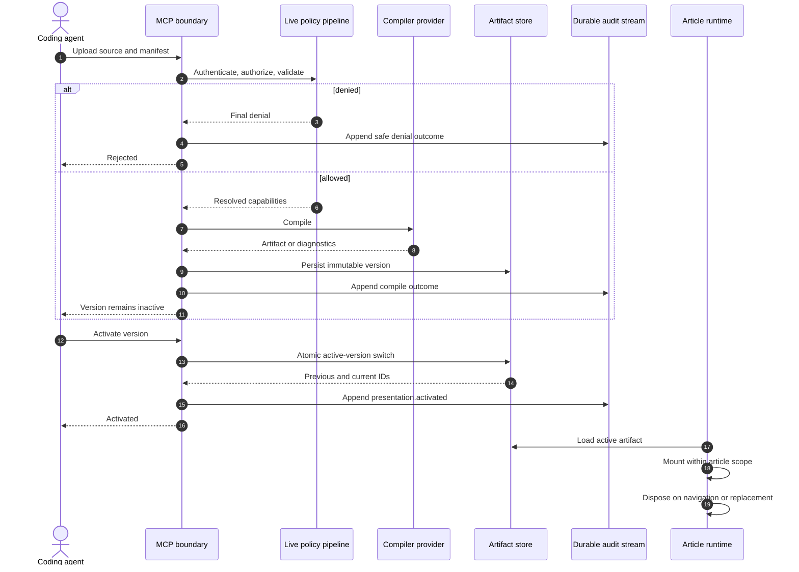
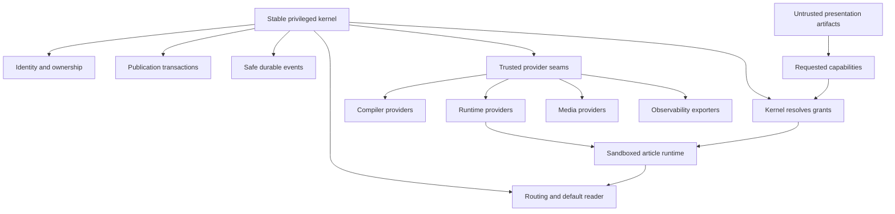

# Cordis and Agent-Native CMS

Cordis is best read as a runtime composition model, not a new syntax or a
replacement for object-oriented or functional programming. DeepSeek Harness
uses it to compose services, typed events, and reversible effects inside a
shared context.

## 1. Cordis in five visual primitives

DeepSeek Harness goes further: its model adapter, tools, session log, agent
loop, UI integrations, and policies are plugins assembled from profiles,
bundles, and configuration overlays.

## 2. Spatiotemporal composability

The Cordis paper frames composition across both space and time.

The important move is that a dependency is not only “which implementation?” It
can also be “in which scope?” and “during which lifecycle interval?”

## 3. Cordis inside a client-server product

Cordis itself is primarily an in-process composition mechanism. A client-server
system can use it to assemble protocol adapters and application capabilities,
but the network boundary still requires an explicit protocol.

This is how the philosophy reaches client-server architecture: transports are
adapters around a composable runtime, not replacements for networking,
authentication, consistency, or durable storage.

## 4. Current Agent-Native CMS architecture

The current codebase already uses dependency inversion around repositories,
the presentation compiler, lifecycle transactions, and audit sinks. It does
not use Cordis, and it does not need a general plugin framework to validate the
core experiment.

## 5. What should be borrowed

| Borrow | CMS interpretation |
| --- | --- |
| Capability seam | Compiler, runtime, media, policy, or storage contract |
| Service provider | Operator-installed trusted implementation |
| Typed event | Ordered validation, policy, observability, and lifecycle stage |
| Reversible effect | Mount/dispose browser runtime resources deterministically |
| Durable event | Explain publication changes from append-only safe metadata |
| Scope | Apply an artifact and its capabilities to one article experience |

## 6. What should not be copied

DeepSeek Harness intentionally has no privileged core to patch. Agent-Native
CMS needs the opposite security guarantee at its center: tenants must never
replace authentication, persistence rules, audit enforcement, or activation
transactions.

## 7. Current and future presentation pipelines

### Current TSX path

### Language-neutral direction

TSX is a productive authoring format today because it supplies a typed
component contract, composable primitives, static validation, and a predictable
React lifecycle. The durable architectural boundary should nevertheless be the
manifest, capabilities, artifact, and lifecycle—not the source language.

## 8. Lifecycle sequence with durable and live events

Live events answer “may this action proceed now?” Durable events answer “what
changed public behavior, who caused it, and can we reconstruct the decision?”

## 9. Architectural destination

The synthesis is:

> Stable kernel, pluggable trusted capabilities, untrusted presentation
> artifacts, reversible article-scoped effects.

## References

- [DeepSeek Harness architecture](https://github.com/deepseek-ai/deepseek-harness/blob/master/docs/architecture.md)
- [DeepSeek Harness Cordis primer](https://github.com/deepseek-ai/deepseek-harness/blob/master/docs/cordis-primer.md)
- [DeepSeek Harness capability seams](https://github.com/deepseek-ai/deepseek-harness/blob/master/docs/capability-seams.md)
- [A Programming Paradigm for Spatiotemporal Composability](https://arxiv.org/abs/2608.25512)
- [Capability-oriented presentation runtime proposal](../../future/capability-oriented-presentation-runtime.md)
- [Future architecture diagrams](../../future/architecture-diagrams.md)

