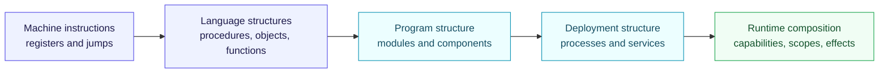
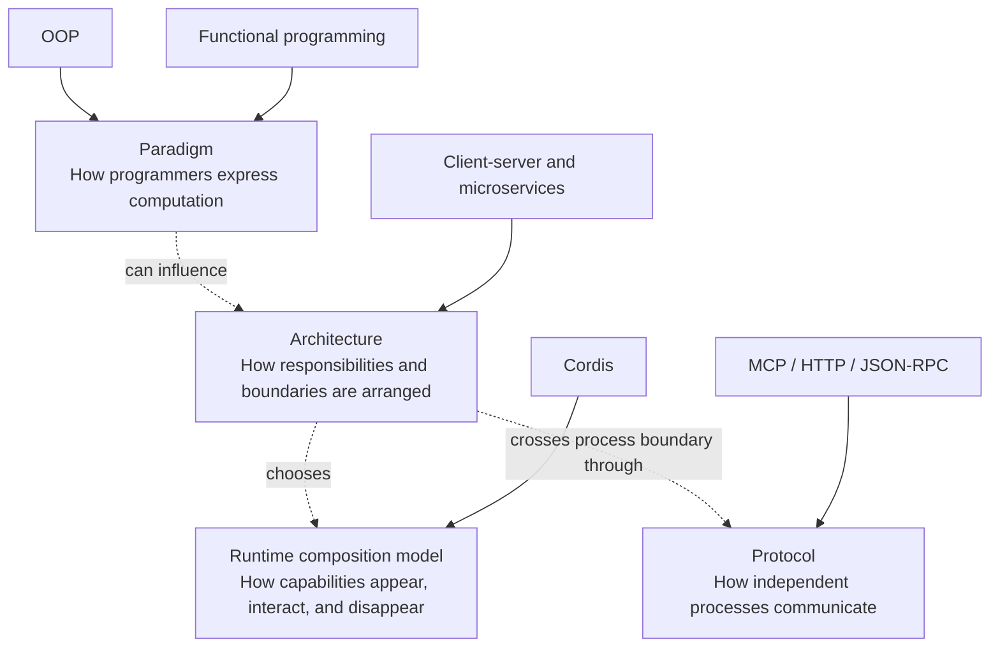

# From machine instructions to runtime composition

This visual survey connects three questions:

1. How does source code become a running program?
2. Which programming paradigms made growing software easier to reason about?
3. Where do Cordis and Agent-Native CMS fit in that history?

The short answer is that these ideas operate at different layers. A CPU executes
instructions, a language shapes programs, an architecture separates systems,
and a runtime composition model decides which capabilities exist **here and
now**.

## Reading map

| Question | Visual guide |
| --- | --- |
| How does code become a process? | [How programs run](01-how-programs-run.md) |
| What problem did each paradigm solve? | [Programming paradigms survey](02-programming-paradigms-survey.md) |
| How do libraries, DLLs, plugins, and services differ? | [Linking, components, and plugins](03-linking-components-and-plugins.md) |
| What is Cordis, and what should this CMS borrow? | [Cordis and Agent-Native CMS](04-cordis-and-agent-native-cms.md) |

## Keep the layers distinct

Cordis is therefore not “the paradigm after OOP.” It addresses a different
problem: composing replaceable services and reversible effects across scopes
and time inside a host runtime.

## Terminology

| Term | Working meaning in this survey |
| --- | --- |
| Program | Instructions plus data prepared for execution |
| Process | A running program with an address space and OS resources |
| Runtime | The environment managing execution, loading, memory, events, or code |
| Module | A unit with a defined namespace and dependency boundary |
| Component | A replaceable unit with an interface and lifecycle |
| Service | A capability reached through a stable contract, locally or remotely |
| Plugin | Code loaded by a host through a documented extension contract |
| Capability | An explicit authority to perform a bounded operation |
| ABI | Binary-level rules that independently compiled code must share |

## Scope

This is a conceptual map, not a complete history of programming languages or
processor design. Each section focuses on the pressure that caused a new
abstraction to appear, what it improved, and what problem it left behind.

